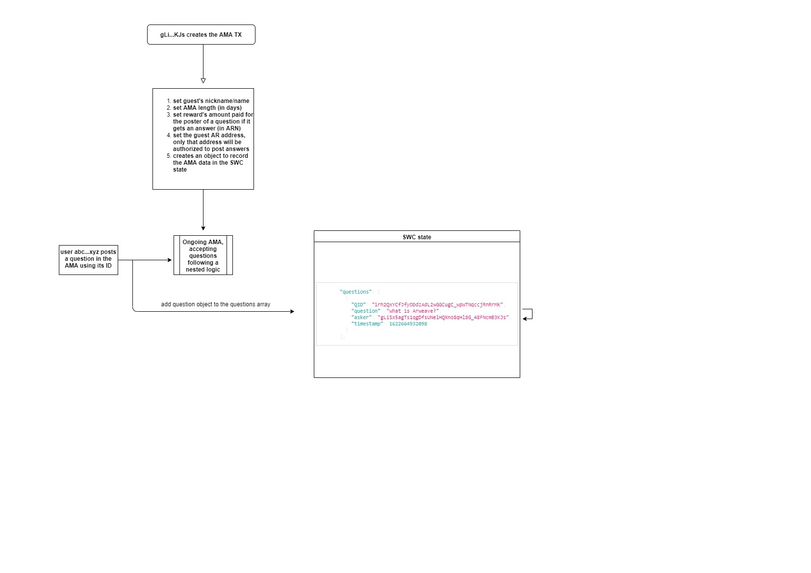

## AMA Protocol based on SmartWeave

# Synopsis
This protocol introduces an all new method to create and organize AMAs (Ask Me Anything).

# Workflow
## Creating AMA and questions submission:

# License 
This protocol is licensed uner the MIT license
